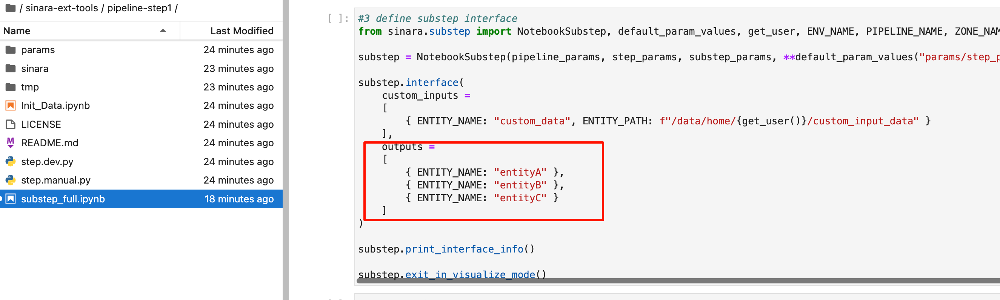
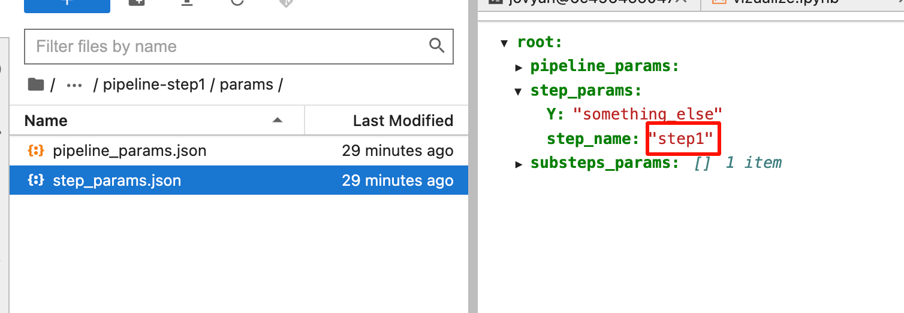

# How it works

Prerequisites

- Docker is up and running
- Git installed
- Unzip installed (On Linux and MacOS)

# Deploy an environment for a single use

```
git clone --recursive https://github.com/4-DS/sinara-ext-tools.git
cd sinara-ext-tools
```

## To make use of the environment, run:
Linux and MacOS:<br>
```
bash create.sh
bash run.sh
```
Windows (PowerShell):<br>
```
.\create.ps1
.\run.ps1
```
### Open Jupyter Notebook Server at http://127.0.0.1:8888/lab in any browser
Inside Jupyter server terminal run:<br>
```
git clone --recursive https://github.com/4-DS/step_template.git
cd step_template
```

### Run 'Init_Data.ipynb' to get sample data

### Run 'step.dev.py' in Jupyter server terminal: 

```
python step.dev.py
```

## To stop using the environment for a while, run:
Inside sinara-ext-tools folder<br>
Linux and MacOS:<br>
```
bash stop.sh
```
Windows (PowerShell):<br>
```
.\stop.ps1
```
## To continue using the environment, run:
Linux and MacOS:<br>
```
bash run.sh
```
Windows (PowerShell):<br>
```
.\run.ps1
```
## To remove the environment, run:
Linux and MacOS:<br>
```
bash remove.sh
```
Windows (PowerShell):<br>
```
.\remove.ps1
```
# Pipeline quiсk conceptual intro
Our framework allows you to create and visualize ML pipelines. They consist of steps. Another word, each element of the DAG is a step. At the output and at the input of each step we have entities. An entity is a dataset that is saved in the file system folder as a parquet file. Each step (component) of the pipeline is implemented as a separate Git repository. Each step is created based on a template.

ML pipeline example is shown at the picture below:


Each step is implemented as a sequence of substeps (Jupyter notebooks). Each Jupyter notebook that implements the substep contains 2 special cells at the beginning: 
1. a cell with parameters;
2. a cell with an interface. 

And the interface is a description of the inputs and outputs (entities).

# ML pipeline tutorial

To implement the pipeline in the picture above, please follow these steps:

1. Open Jupyter Notebook Server at http://127.0.0.1:8888/lab in any browser<br>
2. Clone Sinara internal tools repo:
```
git clone https://github.com/4-DS/sinara-int-tools.git
```
3. Automatically create your pipeline structure in GitHub with as many steps as you want.
```
bash create_pipeline.sh
``` 
4. Go to steps folders and define interfaces:



5. Define a step name for each repository:



6. Build design of your ML pipeline:<br>
Open ```visualize.ipynb``` notebook and replace an example step folder glob inside visualize() function call to your actual steps folder glob<br>
Run ```visualize.ipynb``` notebook

Also, you can try a ready example:

1. Clone the ready repos:
```
git clone --recursive https://github.com/4-DS/pipeline-step1.git
git clone --recursive https://github.com/4-DS/pipeline-step2.git
git clone --recursive https://github.com/4-DS/pipeline-step3.git
git clone --recursive https://github.com/4-DS/pipeline-step4.git
```

2. Open ```visualize.ipynb``` from sinara-int-tools repository
3. Change glob path in visualize() to the folder where steps are cloned
4. Run the notebook cells

# Model serving intro

Now we know how to implement an abstract ML pipeline, but we need more:
at the output, we need to get a model packaged in a Docker container and being accessible via the REST interface. Sinara framework allows you to save a bentoservice as an output entity. In fact, bentoservice is a Python class wrapper for packaging a model with a REST interface. Additionally, Sinara framework provides a contenraize tool to create a Docker image based on a bentoservice. As a result, the name of the image is such that you can then understand from which bentoservice it was created.

# Model serving tutorial
### Open Jupyter Notebook Server at http://127.0.0.1:8888/lab in any browser
Inside Jupyter server terminal run:<br>
1. Clone the ready model (a step of your pipeline):
```
git clone --recursive https://github.com/4-DS/pipeline-model_train.git
```

2. Create bentoservice entity from your model:
```
cd pipeline-model_train
python step.dev.py
```

3. Pick up the entity path for your model packed as a bentoservice entity:


4. Run a containerize tool from sinara-ext-tools (cloned earler on the host) for getting Docker image of your model. Set run parameters at prompt:<br>
  
Linux and MacOS:<br>
```
bash containerize.sh
```
Windows (Powershell):
```
.\containerize.ps1
```

Now you can use your model in production. Docker image will be automatically versioned as:

```<your_docker_registry>/<env>.<pipeline>.<zone>.<step>:<step_run_id>```

# Full conceptual overview

To be continued..
