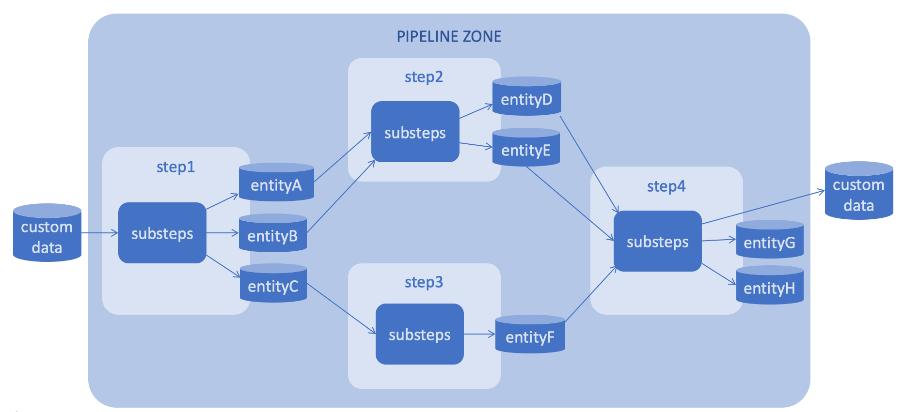

# How it works

Prerequisites

- Docker is up and running
- Git installed

# Deploy an environment for a single use

```
git clone --recursive https://github.com/4-DS/sinara-ext-tools.git
cd sinara-ext-tools
```

## To make use of it, run:
```
bash create.sh
bash run.sh
```

### Go on http://127.0.0.1:8888/lab
```
git clone --recursive https://github.com/4-DS/step_template.git
cd step_template
```

### Run 'Init_Data.ipynb' to get sample data

### Run 'step.dev.py' in Terminal 

```python step.dev.py```

## To stop using it for a while, run:
```
bash stop.sh
```

## To continue using it, run:
```
bash run.sh
```

## To remove it, run:
```
bash remove.sh
```

# Let's create a simple ML pipeline



Once your Sinara single use was deployed, you should create Git repositories for your ML pipeline's steps.
Each step is based on this template repository https://dev.azure.com/swat-team/mlbox/_git/mlbox_step_template by using README.md
In each step you must define:
- inputs
- outputs
- custom_inputs
- custom_outputs
- tmp_inputs
- tmp_outputs

Inputs are some previous steps outputs.
Outputs are some results of a step.
Inputs/outputs are formed base on a special run name which is 'run-%timestamp%'

Custom inputs/outputs

See the ready steps step1-4 of pipeline with the name 'pipeline0' at 
1. https://github.com/4-DS/pipeline-step1.git
2. https://github.com/4-DS/pipeline-step2.git
3. https://github.com/4-DS/pipeline-step3.git
4. https://github.com/4-DS/pipeline-step4.git

Then you can see design of your ML pipeline by running
visualize.ipynb

Download it in the root folder, containing all your steps, set parameters and run


# Let's build production image with your model 


Please, download the ready ML model example:

1. https://github.com/4-DS/pipeline-model_train.git

Run python step.dev.py
Then pick up the entity path for your model packed as a bentoservice entity
Then run bash containerize.sh and set parameters 

Now you get an image with your model ready for intergration with your environment
